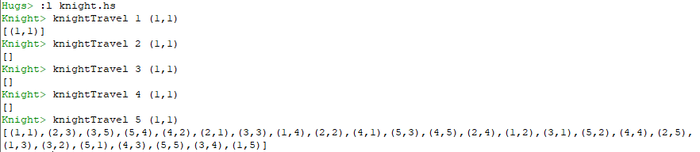
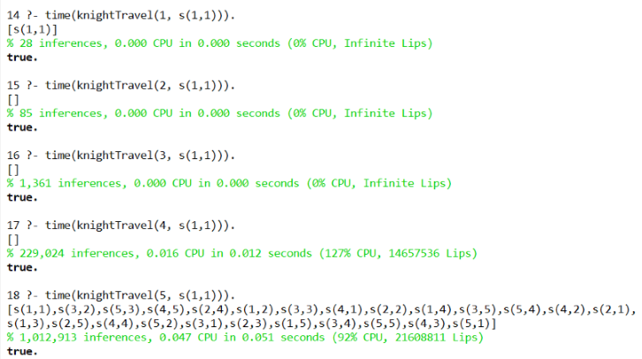

# El viaje del Caballo de Ajedrez

## Introducción
El problema del viaje del caballo es un problema matemático que consiste en encontrar la secuencia de movimientos realizados por el caballo de ajedrez en un tablero. El caballo tiene que visitar todas las casillas del tablero una única vez, es decir, no puede pasar dos o más veces por la misma casilla. El caballo puede terminar en la misma casilla en la que comenzó, lo que se llama camino cerrado, en caso contrario el camino sería abierto.

Se ha implementado la solución a este problema en Haskell y en Prolog, archivos *knight.hs* y *knight.pl* respectivamente. Para ello, se coloca un caballo de ajedrez en una casilla cualquiera de un tablero de NxN casillas, este caballo solo se puede mover de acuerdo a las reglas del ajedrez. Se comprueba si es posible encontrar un camino abierto que permita al caballo visitar todas las casillas del tablero una única vez. La implementación se ha hecho siguiendo un esquema de *Backtracking*.

En este problema hay que tener en cuenta que existirá un camino o secuencia de movimientos dependiendo del tamaño del tablero (no hay solución para N igual a 2, 3 o 4) y de la posición inicial que ocupe el caballo. Además, el problema tiene solución simétrica, por ejemplo, si existe solución para un tablero de tamaño N igual a 5 desde la casilla inicial (1,5), también existe solución para la casilla inicial (5,1) para un tablero del mismo tamaño.

## Muestra de la ejecución
A continuación, se muestran imágenes de la ejecución de ambas soluciones.

1. Ejecución en Haskell:
2. 

3. Ejecución en Prolog: 

